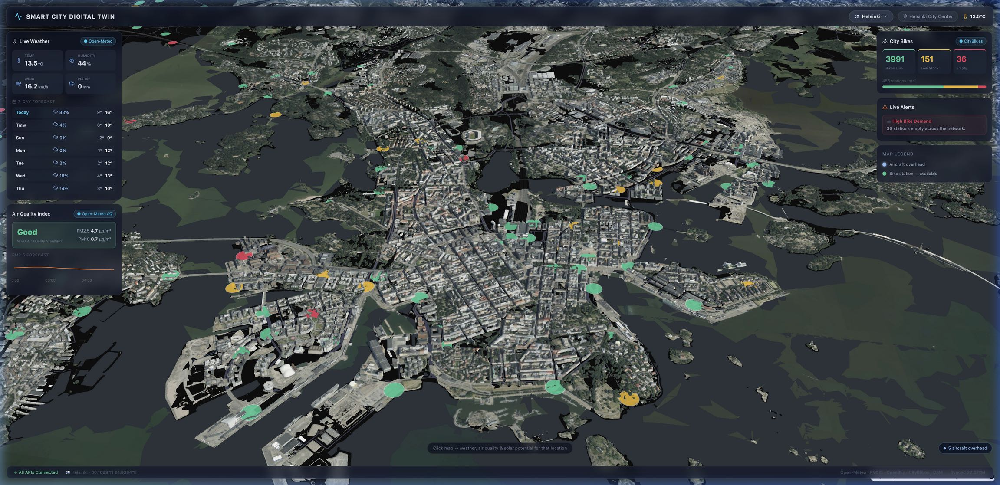
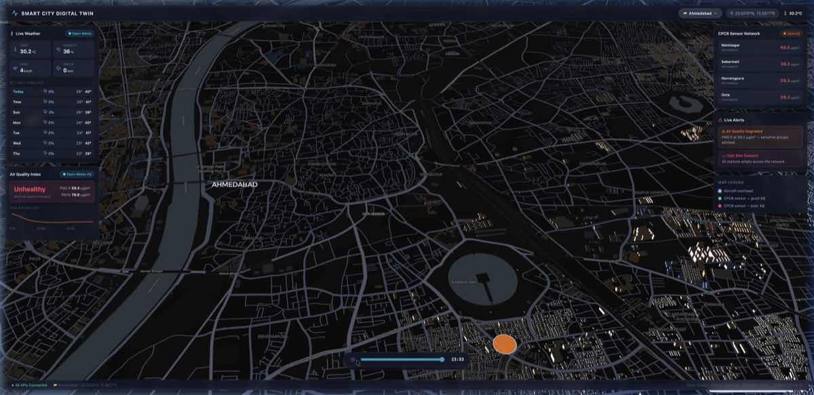
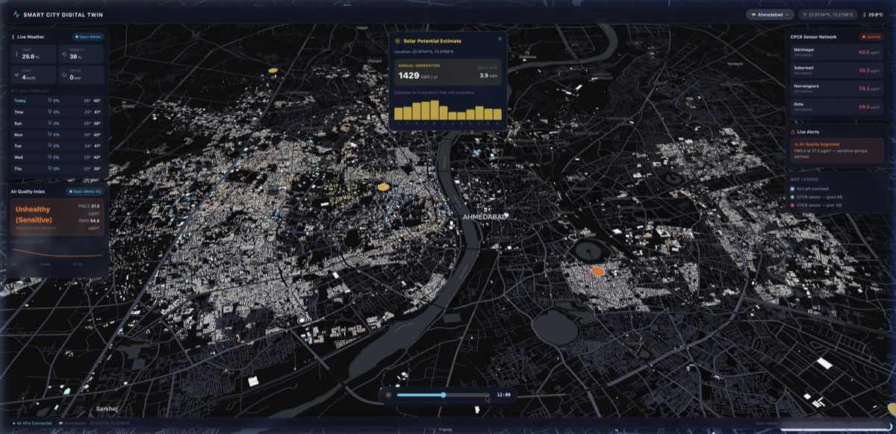
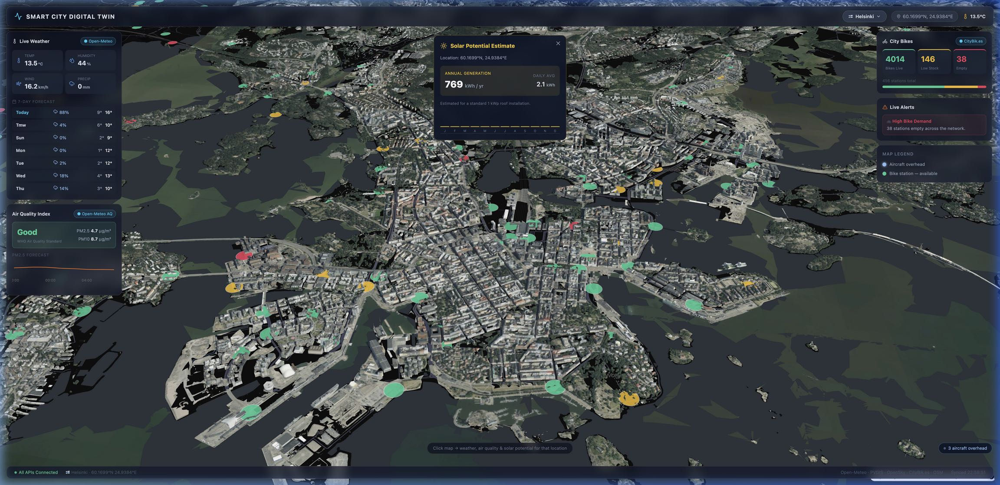

<div align="center">
  
  <h1 align="center">Smart City Digital Twin</h1>
  
  <p align="center">
    A high-performance, open-source 3D Smart City Dashboard capable of visualizing multi-city data with photorealistic reality meshes, extruded satellite footprints, and real-time geospatial intelligence.
    <br />
    <br />
    <a href="#-key-features"><strong>Explore the features »</strong></a>
    <br />
    <br />
    <a href="#-quick-start">Quick Start</a>
    ·
    <a href="https://github.com/theatlyx/smart-city-dashboard/issues">Report Bug</a>
    ·
    <a href="https://github.com/theatlyx/smart-city-dashboard/issues">Request Feature</a>
  </p>

  <p align="center">
    
    
    
    
    
  </p>
</div>

<br />



## 🌟 About The Project

Building a truly dynamic digital twin shouldn't cost millions. This dashboard is built entirely on **100% free, open-source data APIs** and renders massive datasets in the browser at 60 FPS using WebGL.

Currently configured with digital twins for:
- 🇫🇮 **Helsinki, Finland** (Utilizing the official 2024 Helsinki 3D reality mesh)
- 🇮🇳 **Ahmedabad, India** (Extruding >80,000 building footprints dynamically via OpenStreetMap)

## ✨ Key Features

| Feature | Description | Source |
|---------|-------------|--------|
| 🏙️ **Multi-City Architecture** | Switch seamlessly between cities with different API layers and 3D rendering modes (3D Tiles vs. GeoJSON extrusion). | - |
| 🌡️ **Hyper-Local Climate** | Click anywhere on the 3D map to fetch exact weather and air quality for that specific latitude/longitude. | Open-Meteo |
| ✈️ **Live Aviation Tracking** | Real-time aircraft positions, altitudes, velocities, and headings overhead. | OpenSky Network |
| ☀️ **Solar Potential Engine** | Click on any building to calculate its estimated annual solar generation (kWh/yr) using satellite irradiance data. | PVGIS (EU) |
| 📊 **Demographics & Zoning** | Interactive choropleth map of postal codes/zones. Hover to reveal Post Office metadata for urban planning. | Indian Census |
| 💧 **Historical Groundwater** | 26-year historical groundwater analysis (2000-2026). Visually maps depletion/rising hotspots across administrative boundaries with interactive time-series charts. | CGWB |
| 🚲 **Mobility Networks** | Live monitoring of city bike networks (capacities, empty docks) rendered directly on the map. | CityBik.es |
| 📡 **CPCB Sensor Networks** | Real-time air quality index monitoring from physical stations across Indian cities. | OpenAQ |
| 🚦 **Automated Alerts** | Dynamic UI that flags empty bike stations, hazardous AQI events, and more based on the active city. | - |

---

### Dynamic Environment (Time Travel)
The dashboard includes a Time Travel slider that calculates the exact geographic position of the sun based on the selected city's latitude/longitude and the time of day. This creates realistic, sweeping shadows across extruded 3D buildings.

<p align="center">
  
  
</p>
*Early morning long shadows vs. Night time ambiance.*

---


*Interactive solar potential estimations based on location.*

---

### Demographics & Environmental History

Moving beyond real-time API data, the Digital Twin features heavily optimized pipelines to process massive governmental datasets into interactive layers:

<p align="center">
  
  
</p>
*Left: Administrative Zoning View. Right: Historical Groundwater Depletion Choropleth.*

* **Administrative Zoning View:** Transforms the 3D map into a 2D choropleth displaying precise administrative boundaries (e.g., Pincodes) to assist urban planners.
* **Groundwater Analysis:** Maps 26 years of water depth sensor data (2000–2026) onto administrative zones using Spatial Joins (Nearest Neighbor).
  * **Red Zones:** Water levels have dropped since 2000 (Depletion).
  * **Green Zones:** Water levels have risen since 2000.
  * Hovering over any zone reveals an interactive `recharts` Line Chart of the 26-year historical trend.

## 🛠️ Architecture

* **Frontend:** React 18, Vite, Deck.gl (for high-performance WebGL geospatial layers), MapLibre GL, Recharts, and Tailwind CSS.
* **Backend:** FastAPI proxy. The Python backend fetches, formats, and caches (90s TTL) responses from various free external APIs to prevent the browser from hitting rate limits.
* **Data Pipelines:** Python scripts interacting with the Overpass API to dynamically fetch and process satellite/OSM data into optimized GeoJSON.

## 🚀 Quick Start

To get a local copy up and running, follow these simple steps.

### Prerequisites

* Node.js (v18+)
* Python 3.10+

### 1. Start the Backend (FastAPI Proxy)

The backend is strictly required to bypass rate limits and format the data.

```bash
cd backend
python -m venv venv

# Activate the virtual environment
source venv/bin/activate  # On Windows: venv\Scripts\activate

# Install dependencies
pip install fastapi uvicorn requests cachetools

# Start the server
uvicorn app.main:app --reload --port 8000
```

### 2. Start the Frontend

In a new terminal window:

```bash
cd frontend
npm install
npm run dev
```

Open `http://localhost:5173` in your browser.

## 🌍 Adding a New City

The application is highly modular. To add your own city:

1. Open `frontend/src/context/CityContext.tsx`.
2. Add a new object to the `CITIES` mapping:
   ```typescript
   my_city: {
     id: 'my_city',
     name: 'My City',
     lat: 40.7128,
     lon: -74.0060,
     zoom: 13,
     pitch: 60,
     bearing: 0,
     flag: '🇺🇸',
     buildings: 'geojson',
     geojsonUrl: '/buildings_my_city.json',
     features: ['weather', 'openaq'] // Toggle APIs here
   }
   ```
3. Run the automated data pipeline script to fetch building footprints for your city bounding box:
   ```bash
   python backend/scripts/fetch_ahmedabad_buildings.py
   ```
   *(Modify the script's coordinates to match your city, then move the output JSON to `frontend/public/`)*.

## 🤝 Contributing

Contributions are what make the open source community such an amazing place to learn, inspire, and create. Any contributions you make are **greatly appreciated**.

If you have a suggestion that would make this better, please fork the repo and create a pull request. You can also simply open an issue with the tag "enhancement".

1. Fork the Project
2. Create your Feature Branch (`git checkout -b feature/AmazingFeature`)
3. Commit your Changes (`git commit -m 'Add some AmazingFeature'`)
4. Push to the Branch (`git push origin feature/AmazingFeature`)
5. Open a Pull Request

## 📄 License

Distributed under the MIT License. See `LICENSE` for more information.

## 👏 Acknowledgments

* [Deck.gl](https://deck.gl/) for the incredible WebGL framework.
* Official Helsinki 3D Reality Mesh team.
* [Open-Meteo](https://open-meteo.com/) for open-source weather data.
